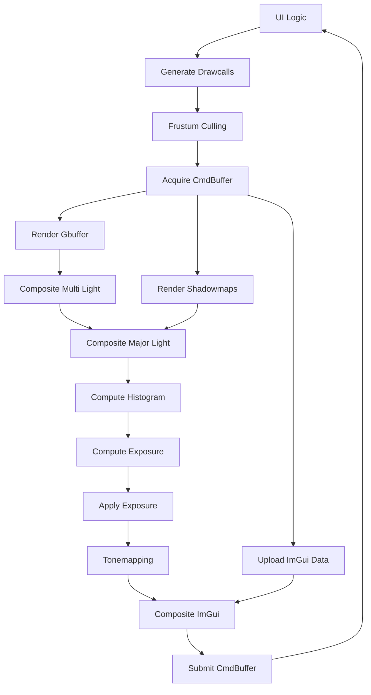

# Main Loop

```mermaid
graph TB
	ui_logic[UI Logic]
	gen_drawcall[Generate Drawcalls]
	frustum_culling[Frustum Culling]
	acq_cmdbuffer[Acquire CmdBuffer]
	render_gbuffer[Render Gbuffer]
	upload_imgui[Upload ImGui Data]
	render_shadowmaps[Render Shadowmaps]
	composite_multilight[Composite Multi Light]
	composite_majorlight[Composite Major Light]
	compute_histogram[Compute Histogram]
	compute_exposure[Compute Exposure]
	apply_exposure[Apply Exposure]
	tonemapping[Tonemapping]
	composite_imgui[Composite ImGui]
	submit_cmdbuffer[Submit CmdBuffer]

	ui_logic --> gen_drawcall --> frustum_culling --> acq_cmdbuffer

	acq_cmdbuffer --> upload_imgui
	acq_cmdbuffer --> render_gbuffer
	acq_cmdbuffer --> render_shadowmaps
	render_gbuffer --> composite_multilight
	composite_multilight --> composite_majorlight
	render_shadowmaps --> composite_majorlight

	composite_majorlight --> compute_histogram --> compute_exposure --> apply_exposure --> tonemapping

	tonemapping --> composite_imgui
	upload_imgui --> composite_imgui

	composite_imgui --> submit_cmdbuffer

	submit_cmdbuffer --> ui_logic
```