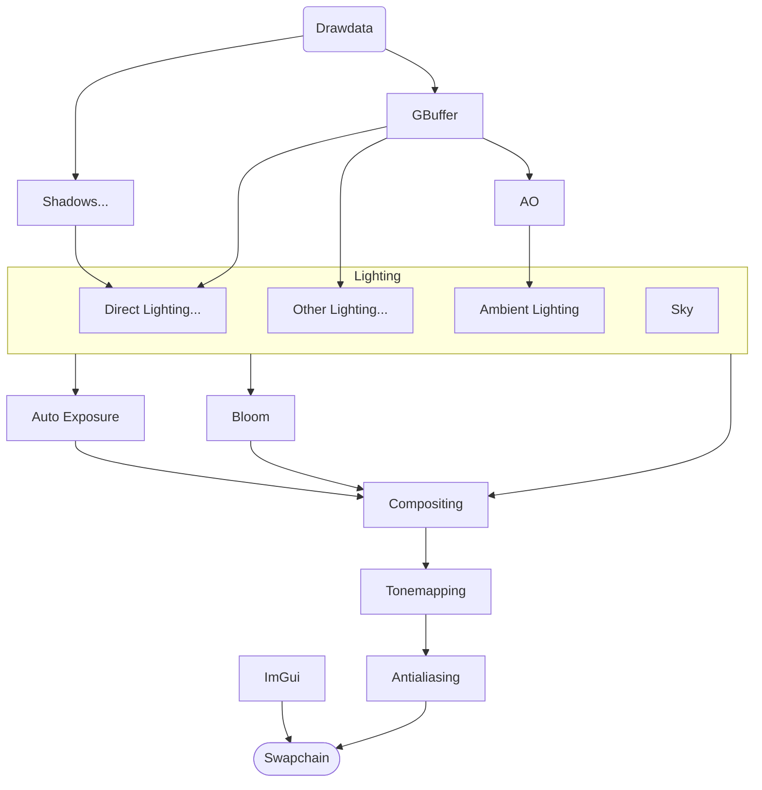

# Render Procedure

```mermaid
graph TB
	drawdata(Drawdata)
	gbuffer[GBuffer]
	shadows[Shadows...]
	ao[AO]

	subgraph Lighting
		direct_lighting[Direct Lighting...]
		other_lighting[Other Lighting...]
		ambient[Ambient Lighting]
		sky[Sky]
	end

	exposure[Auto Exposure]
	bloom[Bloom]
	composite[Compositing]
	aa[Antialiasing]
	tonemap[Tonemapping]
	imgui[ImGui]
	swapchain([Swapchain])

	drawdata --> gbuffer
	drawdata --> shadows
	gbuffer --> ao
	ao --> ambient
	shadows --> direct_lighting
	gbuffer --> direct_lighting
	gbuffer --> other_lighting
	Lighting --> exposure
	Lighting --> bloom
	Lighting --> composite
	exposure --> composite
	bloom --> composite
	composite --> tonemap
	tonemap --> aa
	imgui --> swapchain
	aa --> swapchain

```